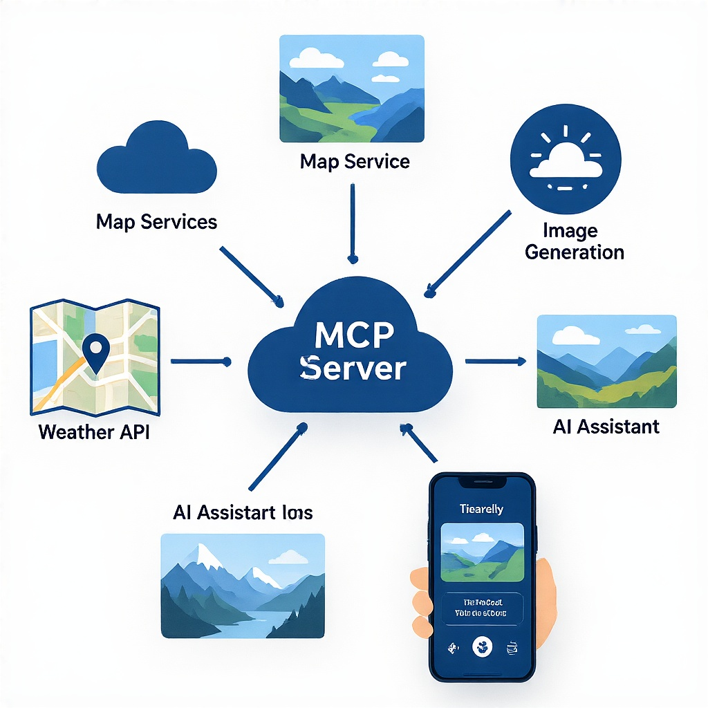
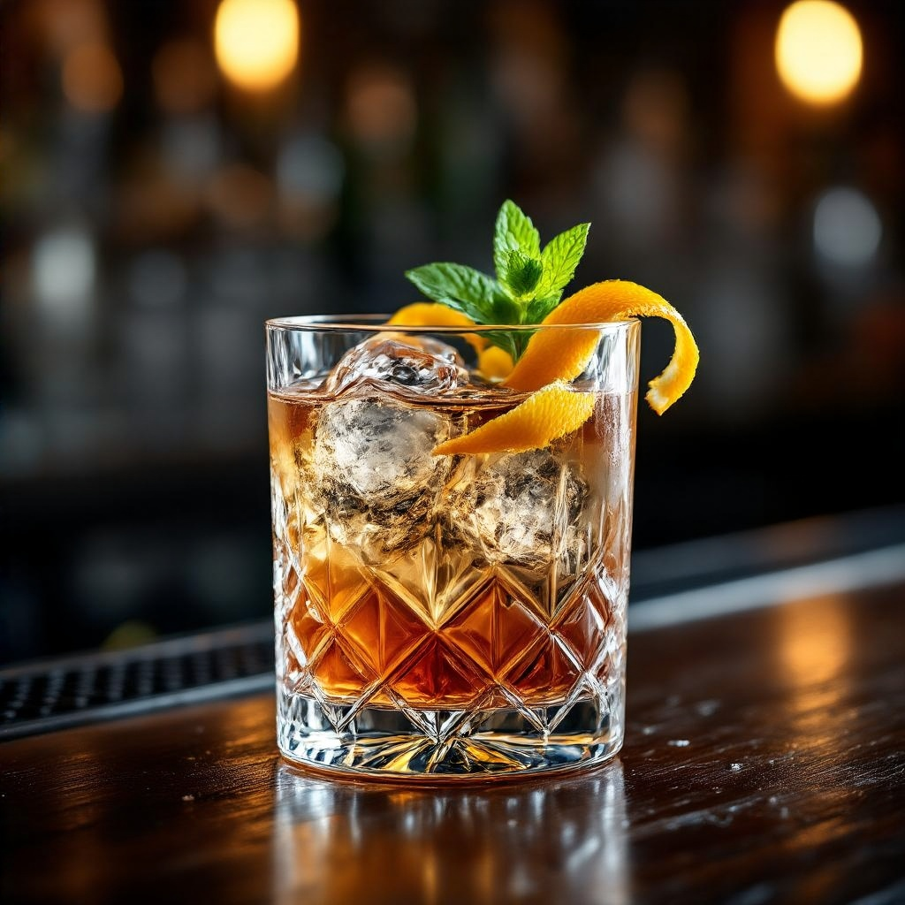

# FAL AI Image Generator MCP

A Model Context Protocol (MCP) server for generating images using the FAL.ai platform and HiDream-ai/HiDream-I1-Full model.

## Overview

This MCP server provides a simple interface to generate high-quality images from text prompts using FAL.ai platform and HiDream-ai/HiDream-I1-Full model. It leverages the Model Context Protocol (MCP) to make image generation capabilities easily accessible to your clients.

### Features

- Text-to-image generation using image generation model [HiDream-ai/HiDream-I1-Full](https://huggingface.co/HiDream-ai/HiDream-I1-Full), check link for more models details
- [FAL.ai](https://www.fal.ai) API with a single tool for generating images from text prompts
- Returns complete metadata including image URL or base64 image data, dimensions, and other information
- Easy integration with MCP-compatible applications
- Consistent and reliable image output

### Prerequisites

- Python 3.13 or higher
- A FAL.ai API key (sign up at [FAL.ai](https://www.fal.ai))
- `uv` or `pip` package manager


## Connecting to the MCP Server

To connect to the MCP server from an MCP-compatible client, add the following configuration to your MCP config file:

### Method 1: Directly Connect to GitHub-hosted Version

```json
{
  "mcpServers": {
    "fal-ai-image-generator": {
      "command": "uvx",
      "args": [
        "git+https://github.com/OKitchen/fal-ai-mcp"
      ],
      "env": {
        "FAL_KEY": "your-fal-api-key"
      }
    }
  }
}
```
### Method 2: Local environment Usage

## Installation

### Option 1: Install directly from GitHub

```bash
# Using uv (recommended)
export FAL_KEY="your-fal-api-key" && uvx git+https://github.com/OKitchen/fal-ai-mcp

# Using pip
export FAL_KEY="your-fal-api-key" && pip install git+https://github.com/OKitchen/fal-ai-mcp
```

### Option 2: Clone and install locally

```bash
# Clone the repository
git clone https://github.com/OKitchen/fal-ai-mcp.git
cd fal-ai-mcp

# Install dependencies
uv pip install -e .
# or
pip install -e .
```

### Running the MCP Server

You need to set your FAL.ai API key as an environment variable before running the server:

####  Using MCP Dev Mode (Recommended for Local Development)

For local development, you can use the MCP development mode which provides helpful debugging information:

```bash
# Navigate to your project directory
cd /path/to/fal-ai-mcp

# Set your FAL.ai API key
export FAL_KEY="your-fal-api-key"

# Run the server in dev mode
uv run mcp dev fal-ai-mcp/src/pypi_mcp/pypi_mcp_test.py
```

### Locally Connection

To connect to your local version of the server, use this configuration, and added to your `mcp_config.json` file.:

```json
{
  "mcpServers": {
    "fal-ai-image-generator": {
      "command": "uv",
      "args": [
        "--directory",
        "/path/fal-ai-mcp",
        "run",
        "-m",
        "pypi_mcp"
      ],
      "env": {
        "FAL_KEY": "your-fal-api-key"
      }
    }
  }
}
```

Make sure to replace `/path/fal-ai-mcp` with the actual path to your local project directory and `your-fal-api-key` with your actual FAL.ai API key.


## API Reference

The MCP server exposes a single tool:

### `text_to_image_fal`

Generates an image from a text prompt using python library [fal_client](https://pypi.org/project/fal-client/) to access HiDream-I1-Full model.

**Parameters:**
- `prompt` (string): The text description of the image you want to generate

**Returns:**
- A dictionary containing the generated image data, including:
  - `images`: Array of generated images with URLs, dimensions, and content type
  - `timings`: Performance metrics
  - `seed`: The random seed used for generation
  - `has_nsfw_concepts`: Safety check results
  - `prompt`: The original prompt

### Response Format Details

The response from `text_to_image_fal` is a rich JSON object containing detailed information about the generated image. Here's a breakdown of the key fields:

```json
{
  "images": [
    {
      "url": "https://v3.fal.media/files/rabbit/xxxx.jpeg",
      "width": 1024,
      "height": 1024,
      "content_type": "image/jpeg"
    }
  ],
  "timings": {
    "inference": 23.09505701251328
  },
  "seed": 12345,
  "has_nsfw_concepts": [
    false
  ],
  "prompt": "A beautiful mountain landscape with a lake and sunset"
}
```
but recently I find the response format is different, by using HiDream-I1-Full model it got  "url" field like this: 
```
'url': 'data:image/jpeg;base64,/9j/xxxxxxxxxxxxxxxxxxxxxxxxxxxxxxxxxx'
```
It is a base64 encoded image data. so you need to decode it to get the image.
you can use the following code to decode it:
```python
import re
import base64
import json

# Read the 1.md file
with open('1.md', 'r') as file:
    content = file.read()

# Extract the base64 data
match = re.search(r"'data:image\/jpeg;base64,([^']+)'", content)
if match:
    base64_data = match.group(1)
    
    # Decode the base64 data
    image_data = base64.b64decode(base64_data)
    print(image_data)
    
    # Save to file
    with open('decoded_image.jpg', 'wb') as image_file:
        image_file.write(image_data)
    
    print("Image successfully saved as 'decoded_image.jpg'")
else:
    print("Could not find base64 image data in the file") 
```

- **images**: Contains an array of generated images (typically just one)
  - **url**: Base64 encoded image data
  - **width/height**: Dimensions of the generated image (typically 1024x1024)
  - **content_type**: MIME type of the image (usually "image/jpeg")
- **timings**: Performance metrics for the generation process
  - **queue_time**: Time spent waiting in queue
  - **inference_time**: Time spent on actual image generation
  - **total_time**: Total processing time
- **seed**: The random seed used for this generation
- **has_nsfw_concepts**: Boolean flag indicating if NSFW content was detected
- **prompt**: The original text prompt used for generation

## Examples

### Example 1: Generate a landscape image

```python
result = text_to_image_fal(prompt="A professional tech illustration showing MCP (Model Context Protocol) architecture connecting multiple AI services for travel planning. The image should display a central hub labeled \"MCP Server\" with connections to map services, image generation, weather API, and AI assistants. Include travel elements like a map, photos of scenic destinations, and a smartphone displaying an itinerary. Digital, clean, modern style with blue and white color scheme, suitable as a cover image for a technical tutorial.")
image_url = result["images"][0]["url"]
```


### Example 2: Generate a futuristic cityscape

```python
result = text_to_image_fal(prompt="Elegant cocktail in a crystal glass with ice, garnished with citrus peel and mint, professional photography with soft lighting, on a dark wooden bar counter")
image_url = result["images"][0]["url"]
```



## License

MIT

## Acknowledgements

- [FAL.ai](https://www.fal.ai) for providing the image generation API
- [Model Context Protocol (MCP)](https://modelcontextprotocol.github.io/) for the protocol specification
- The open-source community [Hugging Face](https://huggingface.co/) for inspiration and support

## Contributing

Contributions are welcome! Please feel free to submit a Pull Request to enhance the functionality or documentation of this MCP server.